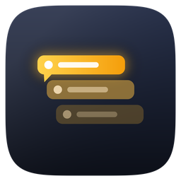
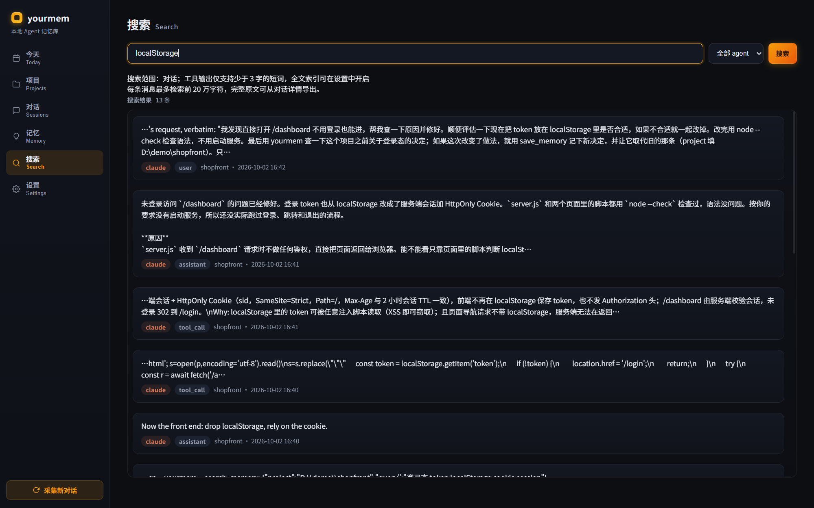

<div align="center">



# yourmem

[简体中文](README.md) · [Download](https://github.com/keros68/yourmem/releases/latest) · [Get started](#get-started) · [User guide (Chinese)](docs/guide.md) · [Development (Chinese)](docs/development.md) · [License](#license)

**Archive and search conversations from multiple AI coding agents on your own machine, keep project memory, and hand it to the next agent over MCP.**

</div>

yourmem is a Tauri 2 desktop app for Windows and macOS. Conversations are collected incrementally from each agent's local records and stored with their original text and source. No cloud account is needed, and chats and memory are never uploaded.

<p align="center">
  
</p>

## Features

- **Unified archive**: discovers existing conversations and collects new ones incrementally. Browse by project, agent, and message type, and search Chinese and English full text across all sources. Archived content can still be verified, exported, and restored after the original tool deletes its history files.
- **Conversation lineage**: detects continuations, forks, compactions, and subtasks, and draws them as a lineage graph. Text from before a compaction point can still be retrieved.
- **Two kinds of memory**: keeps the revision history of native memory files such as `MEMORY.md` and `AGENTS.md`, and stores decisions, rules, lessons, and preferences as project memory linked to their source conversations, with confirm, supersede, and archive states.
- **Project progress**: project dossiers collect the timeline, decisions, output files, task status, and progress documents. The Today page shows activity by date, project, and agent, and exports a daily report. Optional BYOK API summaries are previewed and only saved after confirmation.
- **MCP access**: one-click setup for Claude Code, Codex, ZCode, Kimi Code, Gemini CLI, Cursor, and Hermes lets agents search history, read project context, and write handoffs. Other stdio MCP clients can run `yourmem mcp`.
- **Backup and migration**: trash bin, weekly incremental snapshots, and full backup bundles with verification that can be restored on another computer or merged into an existing library. Core data and backups can each live on a non-system drive.

## Get started

1. Open [Releases](https://github.com/keros68/yourmem/releases/latest) and download the installer: `yourmem_*_x64-setup.exe` for Windows x64, `yourmem_*_aarch64.dmg` for Apple Silicon, or `yourmem_*_x64.dmg` for Intel Macs.
2. Install and run it. Installers are not code-signed yet, so allow the app manually when the system asks on first launch.
3. On first launch, choose separate locations for core data and backups, and tick the agents to connect (none are selected by default). yourmem then collects new conversations every 60 seconds in the background.
4. Search history in the Search page, or ask a connected agent, for example: "Use yourmem to read this project's context" or "Find the conversation where we fixed this error before."

## Supported agents

| Agent | Conversation source | Resume command | Write back |
| --- | --- | --- | --- |
| Claude Code | `~/.claude/projects` | ✅ | ✅ |
| Codex | `~/.codex/sessions` | ✅ | ✅ |
| OpenCode | `~/.local/share/opencode/opencode.db` | ✅ | ❌ |
| ZCode | `~/.zcode/cli/rollout` | ❌ | ❌ |
| Kimi Code | `~/.kimi-code/sessions` | Main session only | ❌ |
| Hermes | `~/.hermes/state.db` | ✅ | ❌ |
| pi | `~/.pi/agent/sessions` | ✅ | ❌ |
| Antigravity CLI | `~/.gemini/antigravity-cli/brain` | ❌ | ❌ |

What each source provides differs; see Settings → Capability matrix in the app. Trae stores encrypted local data and is not supported.

## Build from source

Requires stable Rust, plus the Tauri 2 system dependencies for the desktop app.

```bash
cargo build                # yourmem CLI
cargo test
cd src-tauri && cargo run  # desktop app in development mode
```

## License

[MIT](LICENSE-MIT) OR [Apache-2.0](LICENSE-APACHE), Copyright © 2026 yourmem contributors.
